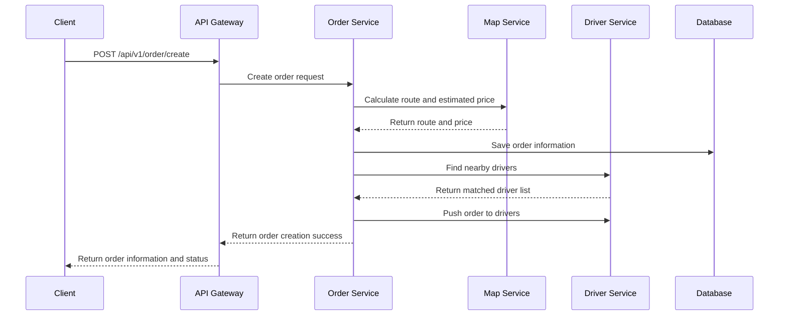
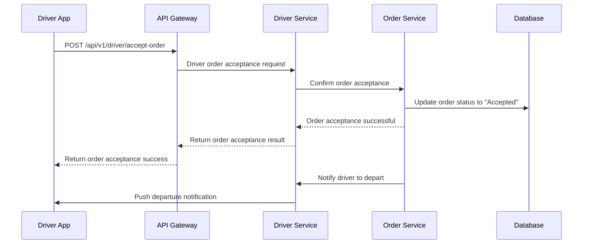

# Shunshun Ride-Hailing Project

## Project Overview
Shunshun Ride-Hailing is a modern ride-hailing platform developed based on Go language, **innovatively integrating both passenger and driver functionalities into a single system**. Through unified API interfaces and flexible role-based permission management, it implements a complete business flow that supports both passenger ride requests and driver order acceptance with a single codebase, providing efficient, safe, and convenient travel services.

The project adopts a microservices architecture and supports full-process functions such as user/driver registration and login, ride/driver order acceptance, payment and settlement, trip management, and message notification, aiming to create a ride-hailing solution with a concise technical architecture and complete business functions.

Ride services are divided into taxi and ride-sharing. Ride-sharing means drivers can offer rides to passengers who happen to be traveling along the same route. It refers to cases where the route planning similarity between passenger's origin-destination and driver's origin-destination reaches 75% or more.

## Technology Stack

### Backend
- **Programming Language**: Go 1.18+
- **Web Framework**: Custom API Gateway
- **RPC Framework**: gRPC
- **Database**: MySQL 8.0+
- **Cache**: Redis 6.0+
- **Service Discovery**: Consul 1.10+
- **Configuration Management**: Viper
- **Authentication**: JWT (Supports dual-role authentication for users/drivers)
- **Logging**: Zap
- **Containerization**: Docker

### Tools and Middleware
- **Code Generation**: Protocol Buffers
- **API Testing**: K6
- **Database Migration**: Custom scripts
- **Encryption Tools**: AES/RSA
- **Map Service**: AutoNavi/Baidu Map API
- **Message Push**: Jiguang Push
- **OCR Service**: Alibaba Cloud OCR

## Project Architecture Design

### Architecture Overview
The Shunshun Ride-Hailing project adopts a **layered microservices architecture**, achieving high maintainability, scalability, and reliability through clear responsibility division and standardized communication protocols.

**Core Architecture Features**:
- **Layered Design**: API Gateway Layer → Service Layer → Domain Layer → Infrastructure Layer
- **Service-Oriented Split**: Split into independent microservices by business domain
- **Standardized Communication**: Use gRPC between internal services, HTTP/JSON for external interfaces
- **Unified Infrastructure**: Shared configuration, logging, monitoring and other infrastructure components

## Project Structure

```
├── api/                    # API interface definitions
│   └── */                  # *-related APIs
│       └── v1/             # Version v1
├── build/                  # Build scripts and configurations
│   └── Dockerfile          # Docker build file
├── configs/                # Configuration files directory
│   └── config.yaml         # Main configuration file
├── internal/               # Internal code (not exposed externally)
│   ├── api-gateway/        # API Gateway
│   │   ├── consts/         # Constant definitions
│   │   ├── handler/        # Request handlers
│   │   ├── middleware/     # Middleware
│   │   ├── request/        # Request models
│   │   ├── router/         # Route definitions
│   │   └── main.go         # Gateway entry point
│   ├── pkg/                # Common packages
│   │   ├── configs/        # Configuration definitions
│   │   ├── global/         # Global variables
│   │   ├── initialization/ # Initialization components
│   │   ├── model/          # Data models
│   │   └── utils/          # Utility functions
│   ├── proto/              # Protobuf generated code
│   └── server-*/           # Services (can be added)
│       ├── server/         # Service implementation
│       └── main.go         # Service entry point
├── scripts/                # Script files
│   ├── k6.js               # Load testing script
│   ├── migrate.sh          # Database migration script
│   └── rebate.sql          # Rebate SQL script
├── .gitignore              # Git ignore file
├── LICENSE                 # License
├── Makefile                # Build script
├── README.en.md            # Project documentation
└── README.md               # Project documentation (chinese)
```

## Core Function Modules

### 1. Unified Authentication and User Management
- **User/Driver Registration and Login** (Unified entry, role differentiation)
- **Personal Information Management** (Support for passenger and driver information fields)
- **Identity Authentication and Authorization** (JWT dual-role authentication)
- **Password Reset and Security Management**
- **Real-Name Authentication** (ID card OCR recognition and verification)

### 2. Order Management (User/Driver Collaboration Function)
- **Passenger-side Functions**:
  - Ride Request (Real-time ride/hailed ride)
  - Order Status Inquiry
  - Trip History Records
  - Order Evaluation and Complaints

- **Driver-side Functions**:
  - Order Push and Acceptance
  - Order Reception and Rejection
  - Trip Start/End Confirmation
  - Driver-side Order History

- **System Functions**:
  - Intelligent Order Matching Algorithm
  - Real-time Trip Tracking
  - Route Planning and Navigation
  - Distance and Time Estimation

### 3. Payment and Settlement System
- **Online Payment** (Support for multiple payment methods)
- **Bill Management and Detail Inquiry**
- **Coupon System and Promotional Activities**
- **Driver Commission Settlement**
- **Refund Processing**

### 4. Message Notification System
- **Real-time Message Push** (Bidirectional for users/drivers)
- **SMS Verification Code Sending**
- **System Notifications and Activity Push**
- **Trip Status Change Notifications**

### 5. Map and Location Services
- **Geolocation Positioning** (Real-time location of users/drivers)
- **Route Planning and Navigation**
- **Distance Calculation**
- **Nearby Driver Search and Display**
- **Heatmap Display** (Driver-side)

### 6. Management Backend Functions
- **User/Driver Management**
- **Order Management and Statistics**
- **Financial Management**
- **System Configuration and Monitoring**

## Dual-Role System Design Highlights

1. **Unified API Interface**: A single set of API interfaces that supports both user and driver roles, reducing code redundancy
2. **Flexible Permission Control**: Role-based access control (RBAC) to ensure different roles can only access corresponding functions
3. **Shared Data Model**: Users and drivers share basic data models while extending their own dedicated fields
4. **Unified Order Process**: Complete process from ride request to payment, supporting collaborative operations on both passenger and driver ends
5. **Real-time Data Synchronization**: Ensure real-time synchronization of order status, location information, etc. between user and driver ends

## Technical Architecture Advantages

1. **Microservices Architecture**: Service modularization, easy to extend and maintain
2. **High Performance**: Developed based on Go language, excellent performance, supporting high concurrency
3. **Scalability**: Support horizontal scaling to handle business growth
4. **High Availability**: Service registration and discovery to ensure stable system operation
5. **Security**: Complete authentication and authorization mechanism to ensure data security
6. **Observability**: Unified logging, monitoring and alerting system

## Quick Start

### Environment Requirements
- Go 1.18+
- MySQL 8.0+
- Redis 6.0+
- Consul 1.10+
- Docker (Optional, for containerized deployment)

### Installation Steps

1. **Clone the project**
```bash
git clone https://github.com/annhay/shunshun.git
cd shunshun
```

2. **Install dependencies**
```bash
go mod download
```

3. **Configuration file**
Modify the `configs/config.yaml` file to configure database, Redis, Consul and other information.

4. **Generate Protobuf code**
```bash
make proto
```

5. **Start services**
```bash
# Start API Gateway
make run-gateway

# Start User Service
make run-user

# Start Driver Service
make run-driver

# Start Order Service
make run-order
```

## Configuration Instructions

The main configuration file is located at `configs/config.yaml`, containing the following key configuration items:

- **server**: Server configuration (port, address, etc.)
- **mysql**: Database connection information
- **redis**: Redis configuration
- **consul**: Service registration and discovery configuration
- **jwt**: JWT dual-role authentication configuration
- **zap**: Log configuration (directory, level, retention time, etc.)
- **aliyun**: Alibaba Cloud service configuration (OCR, etc.)
- **map**: Map service configuration

## Core Process Examples

### Passenger Ride Request Process



### Driver Order Acceptance Process



## API Documentation

### User-related APIs
- `POST /api/v1/user/register` - User registration
- `POST /api/v1/user/login` - User login
- `GET /api/v1/user/profile` - Get user information
- `PUT /api/v1/user/profile` - Update user information
- `POST /api/v1/user/complete-info` - Complete user information
- `POST /api/v1/user/student-verify` - Student verification

### Driver-related APIs
- `POST /api/v1/driver/register` - Driver registration
- `POST /api/v1/driver/login` - Driver login
- `GET /api/v1/driver/profile` - Get driver information
- `PUT /api/v1/driver/profile` - Update driver information
- `POST /api/v1/driver/certify` - Driver certification
- `POST /api/v1/driver/accept-order` - Accept order
- `POST /api/v1/driver/start-order` - Start trip
- `POST /api/v1/driver/end-order` - End trip

### Order-related APIs
- `POST /api/v1/order/create` - Create order
- `GET /api/v1/order/list` - Get order list
- `GET /api/v1/order/detail` - Get order details
- `PUT /api/v1/order/cancel` - Cancel order
- `PUT /api/v1/order/confirm` - Confirm order
- `POST /api/v1/order/pay` - Pay for order
- `POST /api/v1/order/evaluate` - Evaluate order

## Development Guide

### Code Standards
- Follow Go language standard specifications
- Use `go fmt` to format code
- Use `golangci-lint` for code checking

### Commit Standards
- Use Chinese for commit messages
- Commit message format: `[Module] Description`
- Example: `[user] Fix user login verification issue`

### Testing
- Unit tests: `go test ./...`
- API tests: Use K6 for load testing

### New Feature Process
1. Define new API interfaces in the `api/` directory
2. Generate Protobuf code: `make proto`
3. Implement business logic in the corresponding service
4. Register routes in the API Gateway
5. Write test cases
6. Submit code

## Deployment Plan

### Local Development Environment
- Use Docker Compose to start dependent services
- Run each service directly

### Production Environment
- Deploy using Kubernetes cluster
- Configure HPA for auto-scaling
- Use Ingress for traffic management
- Configure monitoring and alerting

### Containerized Deployment
```bash
# Build image
make build

# Run container
make docker-run
```

## Monitoring and Logging

### Monitoring
- Use Prometheus to monitor service metrics
- Use Grafana to visualize monitoring data
- Configure alerting rules

### Logging
- Use Zap for structured logging
- Log levels: debug, info, warn, error
- Log rotation: Daily rotation, keep for 7 days
- Error logs stored separately

## Security Notes

1. **Password Security**: Use bcrypt to encrypt and store passwords
2. **JWT Secret**: Regularly rotate JWT secret keys
3. **API Security**: Implement request rate limiting to prevent brute force attacks
4. **Data Masking**: Mask sensitive data (such as ID card numbers)
5. **HTTPS**: Use HTTPS in production environment
6. **OCR Security**: Ensure secure storage of OCR service access keys

## Common Questions

### Q: How to add new API interfaces?
A: Add new routes and handler functions in the corresponding API directory, then register them in the API Gateway.

### Q: How to extend new services?
A: Create a new service directory under the internal directory, define Protobuf interfaces, implement service logic, and then register with Consul.

### Q: How to handle order status changes?
A: Use event-driven architecture, trigger corresponding events when order status changes, and notify related services.

### Q: How to optimize system performance?
A: You can start from the following aspects:
   - Use caching to reduce database queries
   - Optimize database indexes
   - Use concurrent processing to improve efficiency
   - Design service splitting reasonably

## Contribution Guide

1. **Fork the project**
2. **Create a branch**
3. **Submit code**
4. **Create a Pull Request**

## License

This project is licensed under the MIT License. See the LICENSE file for details.

## Contact Information
- GitHub: Private message
- Project maintainer: None
- Technical exchange group: None
- Issue feedback: <issue link>

---

**Shunshun Ride-Hailing Project** - Making travel simpler, safer, and more convenient!
