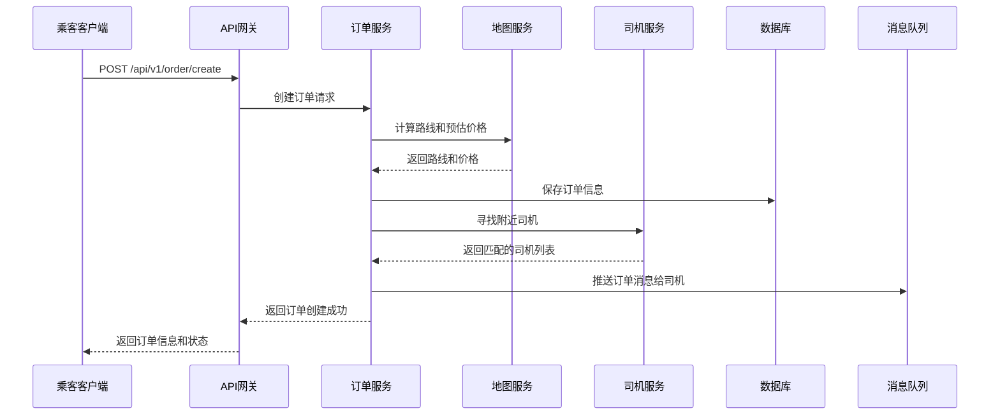
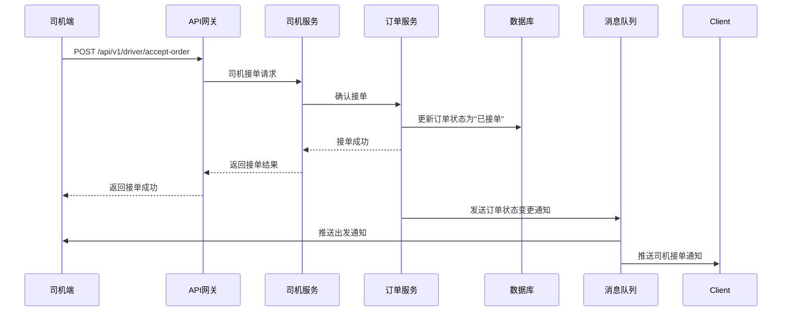

# 顺顺网约车系统

## 项目简介
顺顺网约车系统是一个基于Go语言开发的现代化智能出行平台，**创新性地将乘客端和司机端功能整合到同一系统架构中**。通过统一的API接口和灵活的角色权限管理，实现了一套代码同时支持乘客叫车和司机接单的完整业务流程，为用户提供高效、安全、便捷的出行服务。

系统采用微服务架构设计，支持用户/司机注册登录、智能叫车/接单、在线支付结算、实时行程管理、多渠道消息通知等全流程功能，旨在打造一个技术架构先进、业务功能完备的智慧出行解决方案。

平台提供两种核心服务模式：
- **打车服务**：传统的即时叫车服务，提供快速响应和专业司机
- **顺风车服务**：共享出行模式，当乘客与司机的路线规划相似度达到75%以上时，实现智能拼单，降低出行成本

## 技术栈

### 后端技术
- **编程语言**: Go 1.18+
- **Web框架**: 自定义API网关
- **RPC框架**: gRPC
- **数据库**: MySQL 8.0+
- **缓存**: Redis 6.0+
- **服务注册与发现**: Consul 1.10+
- **配置管理**: Viper
- **认证授权**: JWT (支持用户/司机双角色认证)
- **日志系统**: Zap
- **容器化**: Docker

### 工具与中间件
- **代码生成**: Protocol Buffers
- **API测试**: K6
- **数据库迁移**: 自定义脚本
- **加密工具**: AES/RSA
- **地图服务**: 高德地图/百度地图API
- **消息推送**: 极光推送
- **OCR服务**: 阿里云OCR
- **消息队列**: RabbitMQ (异步通知)
- **实时路况分析**: 高德地图路况API

## 项目架构

### 架构概述
顺顺网约车系统采用**分层微服务架构**，通过明确的职责划分和标准化的通信协议，实现了系统的高可维护性、可扩展性和可靠性。

**核心架构特点**：
- **分层设计**: API网关层 → 服务层 → 领域层 → 基础设施层
- **服务化拆分**: 按业务领域拆分为独立的微服务
- **标准化通信**: 内部服务间使用gRPC，外部接口使用HTTP/JSON
- **统一基础设施**: 共享配置、日志、监控等基础设施组件

## 项目结构

```
├── api/                    # API接口定义
│   └── */                  # 相关API
│       └── v1/             # 版本v1
├── build/                  # 构建脚本和配置
│   └── Dockerfile          # Docker构建文件
├── configs/                # 配置文件目录
│   └── config.yaml         # 主配置文件
├── internal/               # 内部代码（不对外暴露）
│   ├── api-gateway/        # API网关
│   │   ├── consts/         # 常量定义
│   │   ├── handler/        # 请求处理器
│   │   ├── middleware/     # 中间件
│   │   ├── request/        # 请求模型
│   │   ├── router/         # 路由定义
│   │   └── main.go         # 网关入口
│   ├── pkg/                # 公共包
│   │   ├── configs/        # 配置定义
│   │   ├── global/         # 全局变量
│   │   ├── initialization/ # 初始化组件
│   │   ├── model/          # 数据模型
│   │   └── utils/          # 工具函数
│   ├── proto/              # Protobuf生成代码
│   └── server-*/           # 服务（可添加）
│       ├── server/         # 服务实现
│       └── main.go         # 服务入口
├── scripts/                # 脚本文件
│   ├── k6.js               # 压测脚本
│   ├── migrate.sh          # 数据库迁移脚本
│   └── rebate.sql          # 返利SQL脚本
├── .gitignore              # Git忽略文件
├── LICENSE                 # 许可证
├── Makefile                # 构建脚本
├── README.en.md            # 项目文档（英文）
└── README.md               # 项目文档
```

## 核心功能模块

### 1. 统一认证与用户管理
- **用户/司机注册与登录** (统一入口，角色区分)
- **个人信息管理** (支持乘客和司机信息字段)
- **身份认证与授权** (JWT双角色认证机制)
- **密码重置与安全管理**
- **实名认证** (身份证OCR识别与验证)

### 2. 智能订单管理
- **乘客端功能**:
  - 叫车请求 (实时叫车/预约叫车)
  - 订单状态查询
  - 行程历史记录
  - 订单评价与投诉
  - 拼单模式选择

- **司机端功能**:
  - 订单推送与抢单
  - 订单接收与拒绝
  - 行程开始/结束确认
  - 司机端订单历史
  - 实时位置上报

- **系统核心功能**:
  - 智能订单匹配算法
  - 行程实时跟踪
  - 路线规划与导航
  - 距离与时间估算
  - 拼单智能匹配

### 3. 支付与结算系统
- **在线支付** (支持多种支付方式)
- **账单管理与明细查询**
- **优惠券系统与促销活动**
- **司机佣金结算**
- **退款处理**

### 4. 多渠道消息通知
- **实时消息推送** (用户/司机双向)
- **短信验证码发送**
- **系统通知与活动推送**
- **行程状态变更通知**
- **RabbitMQ 异步消息处理**

### 5. 地图与位置服务
- **地理位置定位** (用户/司机实时位置)
- **路线规划与导航**
- **距离计算**
- **附近司机搜索与展示**
- **热力图展示** (司机端)

### 6. 管理后台功能
- **用户/司机管理**
- **订单管理与统计**
- **财务管理**
- **系统配置与监控**

## 双角色系统设计优势

1. **统一API接口**: 一套API接口同时支持用户和司机角色，减少代码冗余，降低维护成本
2. **灵活的权限控制**: 基于角色的访问控制(RBAC)，确保不同角色只能访问对应功能
3. **共享数据模型**: 用户和司机共享基础数据模型，同时扩展各自的专属字段
4. **统一的订单流程**: 从叫车到支付的完整流程，支持用户和司机两端的协同操作
5. **实时数据同步**: 确保用户和司机端的订单状态、位置信息等实时同步
6. **智能拼单算法**: 基于路线相似度的顺风车拼单匹配，提高车辆利用率

## 技术架构优势

1. **微服务架构**: 服务模块化，易于扩展和维护
2. **高性能**: 基于Go语言开发，性能优异，支持高并发
3. **可扩展性**: 支持水平扩展，应对业务增长
4. **高可用性**: 服务注册与发现，确保系统稳定运行
5. **安全性**: 完善的认证授权机制，保障数据安全
6. **可观测性**: 统一的日志、监控和告警系统
7. **异步处理**: 采用RabbitMQ实现消息异步处理，提高系统响应速度
8. **智能缓存**: 实现地理位置和行程距离缓存，减少重复计算
9. **实时路况分析**: 集成高德地图路况API，实现动态价格调整
10. **智能推荐**: 基于路况和距离的多路线推荐系统

## 系统优化亮点

### 性能优化
1. **Redis缓存优化**: 实现地理位置、行程距离和路况信息的缓存，减少重复的地图API调用
2. **Redis锁优化**: 优化用户重复下单的锁机制，提高系统并发处理能力
3. **数据库查询优化**: 使用事务和批量操作，减少数据库交互次数
4. **异步处理**: 采用RabbitMQ实现订单状态变更的异步通知，提高系统响应速度

### 功能增强
1. **实时路况分析**: 集成高德地图路况API，实时获取路线拥堵情况
2. **动态价格调整**: 根据路况拥堵等级自动调整价格，实现智能计价
3. **多路线推荐**: 基于距离、时间和路况的多路线推荐系统
4. **智能拼单算法**: 优化顺风车拼单匹配逻辑，提高车辆利用率
5. **实时通知**: 通过RabbitMQ实现订单状态变更的实时通知

### 用户体验优化
1. **透明定价**: 显示路况信息和价格调整原因，提高用户信任度
2. **路线选择**: 提供多条备选路线，让用户自主选择
3. **实时状态**: 订单状态变更的实时通知，提高用户体验
4. **智能推荐**: 基于历史出行记录和偏好的智能推荐

## 快速开始

### 环境要求
- Go 1.18+
- MySQL 8.0+
- Redis 6.0+
- Consul 1.10+
- Docker (可选，用于容器化部署)

### 安装步骤

1. **克隆项目**
```bash
git clone https://github.com/annhay/shunshun.git
cd shunshun
```

2. **安装依赖**
```bash
go mod download
```

3. **配置文件**
修改 `configs/config.yaml` 文件，配置数据库、Redis、Consul等服务信息。

4. **生成Protobuf代码**
```bash
make proto
```

5. **启动服务**
```bash
# 启动API网关
make run-gateway

# 启动用户服务
make run-user

# 启动司机服务
make run-driver

# 启动订单服务
make run-order
```

## 配置说明

主要配置文件位于 `configs/config.yaml`，包含以下关键配置项：

- **server**: 服务器配置（端口、地址等）
- **mysql**: 数据库连接信息
- **redis**: Redis配置
- **consul**: 服务注册与发现配置
- **jwt**: JWT双角色认证配置
- **zap**: 日志配置（目录、级别、保留时间等）
- **aliyun**: 阿里云服务配置（OCR等）
- **map**: 地图服务配置
- **rabbitmq**: 消息队列配置

## 核心业务流程

### 乘客叫车流程



### 司机接单流程



## API接口文档

### 用户相关接口
- `POST /api/v1/user/register` - 用户注册
- `POST /api/v1/user/login` - 用户登录
- `GET /api/v1/user/profile` - 获取用户信息
- `PUT /api/v1/user/profile` - 更新用户信息
- `POST /api/v1/user/complete-info` - 完善用户信息
- `POST /api/v1/user/student-verify` - 学生认证

### 司机相关接口
- `POST /api/v1/driver/register` - 司机注册
- `POST /api/v1/driver/login` - 司机登录
- `GET /api/v1/driver/profile` - 获取司机信息
- `PUT /api/v1/driver/profile` - 更新司机信息
- `POST /api/v1/driver/certify` - 司机认证
- `POST /api/v1/driver/accept-order` - 接单
- `POST /api/v1/driver/start-order` - 开始行程
- `POST /api/v1/driver/end-order` - 结束行程

### 订单相关接口
- `POST /api/v1/order/create` - 创建订单
- `GET /api/v1/order/list` - 获取订单列表
- `GET /api/v1/order/detail` - 获取订单详情
- `PUT /api/v1/order/cancel` - 取消订单
- `PUT /api/v1/order/confirm` - 确认订单
- `POST /api/v1/order/pay` - 支付订单
- `POST /api/v1/order/evaluate` - 评价订单

## 开发指南

### 代码规范
- 遵循Go语言标准规范
- 使用 `go fmt` 格式化代码
- 使用 `golangci-lint` 进行代码检查

### 提交规范
- 提交信息使用中文
- 提交信息格式：`[模块] 描述`
- 例如：`[user] 修复用户登录验证问题`

### 测试
- 单元测试：`go test ./...`
- API测试：使用K6进行压测

### 新增功能流程
1. 在 `api/` 目录下定义新的API接口
2. 生成Protobuf代码：`make proto`
3. 在对应的服务中实现业务逻辑
4. 在API网关中注册路由
5. 编写测试用例
6. 提交代码

## 部署方案

### 本地开发环境
- 使用Docker Compose启动依赖服务
- 直接运行各个服务

### 生产环境
- 使用Kubernetes集群部署
- 配置HPA自动扩缩容
- 使用Ingress进行流量管理
- 配置监控和告警

### 容器化部署
```bash
# 构建镜像
make build

# 运行容器
make docker-run
```

## 监控与日志

### 监控系统
- 使用Prometheus监控服务指标
- 使用Grafana可视化监控数据
- 配置告警规则

### 日志管理
- 使用Zap进行结构化日志
- 日志分级：debug、info、warn、error
- 日志轮转：每日轮转，保留7天
- 错误日志单独存储

## 安全最佳实践

1. **密码安全**: 使用bcrypt加密存储密码
2. **JWT密钥**: 定期更换JWT密钥
3. **API安全**: 实现请求频率限制，防止暴力攻击
4. **数据脱敏**: 敏感数据（如身份证号）进行脱敏处理
5. **HTTPS**: 生产环境使用HTTPS
6. **OCR安全**: 确保OCR服务的访问密钥安全存储
7. **消息队列安全**: 配置RabbitMQ访问控制

## 常见问题

### Q: 如何添加新的API接口？
A: 在对应的API目录下添加新的路由和处理函数，然后在API网关中注册。

### Q: 如何扩展新的服务？
A: 在internal目录下创建新的服务目录，定义Protobuf接口，实现服务逻辑，然后注册到Consul。

### Q: 如何处理订单状态变更？
A: 使用事件驱动架构，订单状态变更时触发相应的事件，通过RabbitMQ通知相关服务。

### Q: 如何优化系统性能？
A: 可以从以下几个方面入手：
   - 使用缓存减少数据库查询
   - 优化数据库索引
   - 使用并发处理提高效率
   - 合理设计服务拆分
   - 采用异步处理模式

## 贡献指南

1. **Fork项目**
2. **创建分支**
3. **提交代码**
4. **创建Pull Request**

## 许可证

本项目采用MIT许可证，详见LICENSE文件。

## 联系方式
- GitHub: 私信项目维护者
- 技术交流: 项目Issue

---

**顺顺网约车系统** - 智慧出行，从顺顺开始！
